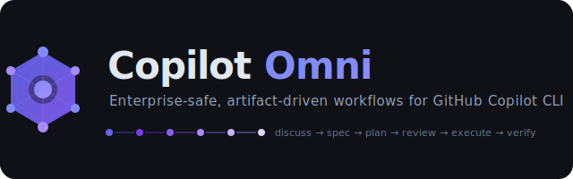

<p align="center">
  <a href="https://github.com/Jurel89/copilot-omni">
    
  </a>
</p>

<p align="center">
  <strong>Artifact-driven, spec-first multi-agent orchestration for GitHub Copilot CLI.</strong><br>
  Pure Python stdlib. Zero compiled binaries. Zero pip dependencies. Corporate-safe by design.
</p>

<p align="center">
  <a href="https://github.com/Jurel89/copilot-omni/actions/workflows/ci.yml"></a>
  <a href="https://www.python.org/downloads/"></a>
  <a href="https://github.com/github/gh-copilot"></a>
  <a href="https://modelcontextprotocol.io/"></a>
  <a href="LICENSE"></a>
  
  
  
  
  <a href="CONTRIBUTING.md"></a>
</p>

<p align="center">
  <a href="#-60-second-quickstart">Quickstart</a>
  &nbsp;·&nbsp;
  <a href="#-why-copilot-omni">Why</a>
  &nbsp;·&nbsp;
  <a href="#-whats-in-the-box">What ships</a>
  &nbsp;·&nbsp;
  <a href="#-architecture">Architecture</a>
  &nbsp;·&nbsp;
  <a href="#-documentation">Docs</a>
  &nbsp;·&nbsp;
  <a href="#-migrating-from-v1x">Migrate v1 → v2</a>
</p>

---

**copilot-omni** turns GitHub Copilot CLI into a spec-first engineering co-worker. Every request flows through a
concreteness-scored front-door router, gets a named plan, runs on a typed pipeline of specialist agents, and leaves
behind a durable audit trail under `.omni/runs/`. You keep Copilot; you get planning, parallelism, policy, and proof.

```bash
# Register the marketplace, then install the plugin by name — the
# forward-compatible flow (direct `owner/repo` installs are being deprecated).
copilot plugin marketplace add https://github.com/Jurel89/copilot-omni
copilot plugin install copilot-omni@copilot-omni
```

## ⚡ 60-second quickstart

```bash
# 1. Prerequisites: GitHub Copilot CLI + Python ≥ 3.9
npm install -g @github/copilot-cli            # skip if already installed
python3 --version                             # POSIX
py -3 --version                               # Windows — either works

# 2. Register the marketplace and install the plugin by name
copilot plugin marketplace add https://github.com/Jurel89/copilot-omni
copilot plugin install copilot-omni@copilot-omni

# 3. Windows corporate only — calibrate the Python interpreter so the MCP
#    server + hooks spawn correctly. No-op on POSIX where `python3` is on PATH.
scripts/omni.cmd doctor --fix-python --fix-python-apply

# 4. Sanity-check the environment (policies, MCP, hooks, Python)
python3 scripts/omni.py doctor          # or: scripts/omni.cmd doctor on Windows

# 5. Scaffold a project — creates .omni/ state directory
python3 scripts/omni.py init

# 6. Let the router decide — vague prompts are auto-refined by deep-interview
copilot -p "autopilot build a habit-tracker CLI with streaks" --allow-all

# 7. Already know what you want? Bypass the interview gate.
copilot -p "autopilot refactor scripts/router.py to use dataclasses --skip-interview" --allow-all

# 8. Run the team orchestrator (tmux on POSIX, subprocess fallback elsewhere)
copilot -p "team run wave-3 plan" --allow-all
```

> **Trial-mode, no install:** `copilot --plugin-dir ./copilot-omni -p "list all skills" --allow-all`

> **Deprecated direct install** (still works but warns):
> `copilot plugin install Jurel89/copilot-omni` — use the marketplace flow above.

## 🎯 Why copilot-omni?

| You want to… | copilot-omni gives you… |
|---|---|
| Ship production code with Copilot CLI, not just prototypes | An artifact trail — plans, specs, run states — under `.omni/runs/` |
| Stop Copilot from diving into vague prompts | A scored [front-door router](docs/ROUTER.md) that redirects ambiguity to `deep-interview` |
| Parallelise long builds safely | `team` orchestrator with tmux + git worktrees, back-pressured subagents, cancel-cascade |
| Pass corporate EDR / security review | Pure Python stdlib. No binaries. No pip installs. `file mcp/server.py` → `ASCII text` |
| Mix fast/deep/ultrabrain reasoning | Semantic [model categories](docs/MODELS.md) resolved per Copilot subscription at runtime |
| Prove the plugin is sound in CI | 18-check [contract validator](scripts/verify_plugin_contract.py) gates every merge |
| Roll back cleanly | `scripts/omni_migrate_v1_to_v2.py --rollback` + idempotent forward migration |

## 📦 What's in the box

<table>
<tr>
<td width="50%" valign="top">

### 29 skills

**29 skills** — ai-slop-cleaner, ask, autopilot, cancel, configure-notifications, debug, deep-dive, deep-interview, deepinit, external-context, mcp-setup, omni-doctor, omni-reference, omni-setup, omni-teams, plan, ralph, ralplan, release, remember, setup, skill, skillify, team, trace, ultraqa, ultrawork, verify, wiki.

Run `omni list skills` for the live catalogue.

### 19 specialist agents
`analyst` · `architect` · `planner` · `critic` · `executor` · `explore` · `debugger` · `tracer` · `verifier` · `qa-tester` · `test-engineer` · `code-reviewer` · `security-reviewer` · `code-simplifier` · `document-specialist` · `writer` · `git-master` · `designer` · `scientist`

Routing cheatsheet in [AGENTS.md](AGENTS.md).

</td>
<td width="50%" valign="top">

### 10 slash commands
`/omni-init` · `/omni-doctor` · `/omni-status` · `/omni-list` · `/omni-plan` · `/omni-ship` · `/omni-verify` · `/omni-memory` · `/omni-do` · `/omni-next`

### 20 MCP tools
Over stdio JSON-RPC 2.0, schema-validated on every call:
`memory` · `wiki` · `notepad` · `state` · `shared-memory` · `trace` · `session` · `policy` · `health` · `doctor` · `config` · `support-bundle`.

Storage: WAL-mode SQLite with `UNIQUE(mode, session_id)`.

### 4 lifecycle hooks
`session_start` · `pre_tool_use` · `post_tool_use` · `user_prompt_submit` — atomic audit logging, five kill-switch env vars, per-hook toggles. See [docs/HOOK_CONTRACT.md](docs/HOOK_CONTRACT.md).

</td>
</tr>
</table>

## 🏗️ Architecture

```
GitHub Copilot CLI
 ├─ reads .claude-plugin/plugin.json         ← plugin manifest
 ├─ discovers skills/ (30), agents/ (19), commands/ (10)
 ├─ wires hooks/hooks.json  → python3 hooks/*.py
 │    ├─ session_start.py       banner, policy checks, metrics
 │    ├─ pre_tool_use.py        policy guard, shlex-safe parse
 │    ├─ post_tool_use.py       audit logging, metrics
 │    └─ user_prompt_submit.py  router + skill trigger hints
 └─ wires .mcp.json         → python3 mcp/server.py
                                 └─ SQLite store at $OMNI_HOME/omni.db
                                     WAL mode · UNIQUE(mode, session_id)

scripts/router.py              scripts/category_resolver.py
  concreteness → gate            quick | deep | ultrabrain
  ├─ score ≥ 0.4 → skill fires      └─ resolved per Copilot subscription
  ├─ score < 0.4 → deep-interview
  └─ --skip-interview → bypass
```

Dive deeper: [ARCHITECTURE](docs/ARCHITECTURE.md) · [ROUTER](docs/ROUTER.md) · [MODELS](docs/MODELS.md) · [TEAM](docs/TEAM.md) · [STATE_MODES](docs/STATE_MODES.md)

## 🛡️ Corporate-safe by design

- **Runtime footprint** — every executed byte is Python 3.9 stdlib or Markdown. No third-party imports (CI-enforced).
- **MCP server** — one Python file, stdio JSON-RPC 2.0, schema-validated. `file mcp/server.py` → `ASCII text`.
- **No binaries** — nothing to compile, nothing to sign, nothing for EDRs to flag.
- **Audit trail** — every tool invocation + hook event appended atomically (`fcntl.flock` / `msvcrt.locking`) under `.omni/audit/`.
- **Five kill-switches** — `OMNI_SKIP_HOOKS`, `DISABLE_OMNI`, plus per-hook `OMNI_SKIP_PRE_TOOL_USE`, `OMNI_SKIP_POST_TOOL_USE`, `OMNI_SKIP_SESSION_START`, `OMNI_SKIP_USER_PROMPT_SUBMIT`.
- **Policy engine** — `policies/{strict,standard,permissive}.json` permission-checked on session start.
- **~520 tests** — unit · integration · MCP-smoke · discovery-smoke · per-module coverage gates (`mcp/` ≥ 80 %, `hooks/` ≥ 70 %, `scripts/` ≥ 60 %).

## 📚 Documentation

| Topic | Document |
|---|---|
| Install paths (RHEL, macOS, Windows, air-gapped) | [docs/INSTALL.md](docs/INSTALL.md) |
| Plugin internals + data flow | [docs/ARCHITECTURE.md](docs/ARCHITECTURE.md) |
| Front-door router + scoring rubric | [docs/ROUTER.md](docs/ROUTER.md) |
| Semantic model categories | [docs/MODELS.md](docs/MODELS.md) |
| Team orchestration (tmux + worktrees) | [docs/TEAM.md](docs/TEAM.md) |
| `team` on Windows | [docs/TEAM-WINDOWS.md](docs/TEAM-WINDOWS.md) |
| Hook contract & kill switches | [docs/HOOK_CONTRACT.md](docs/HOOK_CONTRACT.md) |
| State-mode registry (MCP) | [docs/STATE_MODES.md](docs/STATE_MODES.md) |
| State-store ownership matrix | [docs/STATE_CONTRACT.md](docs/STATE_CONTRACT.md) |
| Four-gate state machine | [docs/STATE-MACHINE.md](docs/STATE-MACHINE.md) |
| Environment variables | [docs/ENV.md](docs/ENV.md) |
| Skills catalogue | [docs/SKILLS.md](docs/SKILLS.md) |
| Internationalisation scaffolding | [docs/I18N.md](docs/I18N.md) |
| Test strategy & coverage gates | [docs/TEST_STRATEGY.md](docs/TEST_STRATEGY.md) |
| v1 → v2 migration guide | [docs/MIGRATION.md](docs/MIGRATION.md) |
| v1 → v2 rollback | [docs/MIGRATION-ROLLBACK.md](docs/MIGRATION-ROLLBACK.md) |
| Architecture Decision Records | [docs/ADR/](docs/ADR/) (ADR-0000 – ADR-0010) |
| Agent routing cheatsheet | [AGENTS.md](AGENTS.md) |
| Changelog | [CHANGELOG.md](CHANGELOG.md) |
| Security policy | [SECURITY.md](SECURITY.md) |

## 🛠️ Install options

```bash
# Marketplace install (recommended, forward-compatible)
npm install -g @github/copilot-cli            # if needed
copilot plugin marketplace add https://github.com/Jurel89/copilot-omni
copilot plugin install copilot-omni@copilot-omni

# Clone + install from local path (useful with mirrored repos / air-gapped)
git clone https://github.com/Jurel89/copilot-omni.git
copilot plugin install ./copilot-omni

# Trial without installing (no side effects)
copilot --plugin-dir ./copilot-omni -p "list all skills" --allow-all

# Legacy direct install — DEPRECATED in current Copilot CLI releases
copilot plugin install Jurel89/copilot-omni
```

No `go build`. No `pip install`. Only Python ≥ 3.9 and the `copilot` CLI on `PATH`.

### Windows — one post-install calibration

Corporate Windows boxes frequently ship `py` or `python` but not `python3`. Run this once
after installing the plugin so the MCP server + hooks spawn against the interpreter you
actually have:

```cmd
:: from the plugin directory (one-time)
scripts\omni.cmd doctor --fix-python --fix-python-apply
```

The command rewrites `.mcp.json` and `hooks\hooks.json` in place with the absolute path
to your Python interpreter. Idempotent — re-run after a plugin upgrade if MCP starts
failing with `-32000 connection closed`.

## 🔁 Migrating from v1.x

<!-- omni-rename-allow: migration-section -->
v1.x used `.omc/` as its state directory and the `/oh-my-claudecode:*` slash-command namespace. v2.0.0
renames both. Run the migrator once per project:

```bash
python3 scripts/omni_migrate_v1_to_v2.py --dry-run   # preview
python3 scripts/omni_migrate_v1_to_v2.py --apply     # execute (idempotent)
```

Full guide: [docs/MIGRATION.md](docs/MIGRATION.md). Rollback path: [docs/MIGRATION-ROLLBACK.md](docs/MIGRATION-ROLLBACK.md).

## 🤝 Contributing

Pull requests welcome. Before you open one:

1. Run the 18-check contract validator — it is the merge gate.
   ```bash
   python3 scripts/verify_plugin_contract.py --all
   ```
2. Run the test suite.
   ```bash
   python3 -m pytest
   ```
3. Keep runtime code to Python 3.9 **stdlib only**. Third-party imports are rejected by CI.
4. Don't add compiled binaries. Don't add npm dependencies. Don't hardcode model names — use `category: quick|deep|ultrabrain`.

Report vulnerabilities via [SECURITY.md](SECURITY.md).

## 📜 License

[MIT](LICENSE) © Copilot Omni contributors.

## 🙏 Acknowledgements

<!-- omni-rename-allow: upstream-reference -->
copilot-omni began as a Copilot-CLI rebuild of the excellent
[`oh-my-claudecode`](https://github.com/Yeachan-Heo/oh-my-claudecode) — without it, none of the
ergonomics would exist. Everything Copilot-specific, the router, the MCP server, the team
orchestrator, the contract validator, and the artifact pipeline were rebuilt from scratch in pure
Python stdlib so the plugin runs anywhere Copilot CLI does and nowhere it doesn't.
