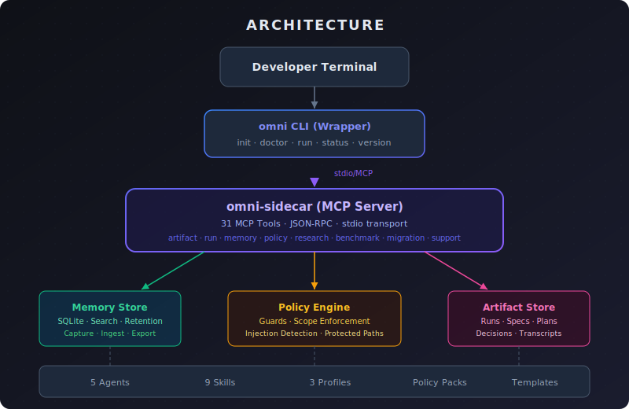

<p align="center">
  
</p>

<p align="center">
  <strong>Enterprise-safe, artifact-driven development workflows for GitHub Copilot CLI</strong>
</p>

<p align="center">
  <a href="https://github.com/Jurel89/copilot-omni/actions/workflows/ci.yml">
    
  </a>
  
  
  
  
  
</p>

---

## What is Copilot Omni?

Copilot Omni transforms GitHub Copilot CLI from an ad-hoc coding assistant into a **structured, auditable, and resumable workflow system**. It enforces enterprise-grade safety policies while providing a phased development lifecycle that produces durable artifacts at every step.

### The Workflow

```
discuss → spec → plan → review → execute → verify
```

Each phase produces a versioned artifact (spec, plan, decisions, transcripts) stored in `.omni/runs/`, enabling full audit trails and workflow resumption.

## Architecture

<p align="center">
  
</p>

| Component | Description |
|-----------|-------------|
| **`omni` CLI** | User-facing wrapper that orchestrates workflows and manages the sidecar process |
| **`omni-sidecar`** | MCP protocol server exposing 31 tools via stdio JSON-RPC |
| **Plugin** | Agent definitions, skills, hooks, and MCP config for Copilot integration |
| **Memory Store** | SQLite-backed persistent memory with search, ingestion, and retention |
| **Policy Engine** | Runtime enforcement of command blocking, path protection, and scope guards |
| **Artifact Store** | Structured storage for specs, plans, decisions, and run transcripts |

## Features

| Feature | Description |
|---------|-------------|
| **Spec-Driven Development** | Formal specification artifacts before any code changes |
| **Guarded Execution** | File-scope enforcement against approved plan targets |
| **Policy Engine** | Three security profiles (strict, standard, permissive) with 6 rule categories |
| **Local Memory** | SQLite-backed persistent memory with full-text search and auto-ingestion |
| **Research Subagents** | Structured multi-source research with provenance tracking |
| **Workflow Resumption** | Resume interrupted workflows from any phase |
| **Audit Trail** | Complete run tracking with export and redaction |
| **Offline Distribution** | Air-gapped installation with signed release bundles and SBOM |
| **Performance Benchmarking** | Budget-based performance gates with regression detection |
| **Schema Migration** | Versioned schema upgrades with rollback safety checks |
| **Support Bundles** | Automated diagnostic collection with secret redaction |
| **Cross-Platform** | Linux, macOS, and Windows; AMD64 and ARM64 |

## Quick Start

### Prerequisites

- [Go 1.25+](https://go.dev/dl/)
- [GitHub Copilot CLI](https://docs.github.com/en/copilot/managing-copilot/using-github-copilot-in-the-command-line)

### Build from Source

```bash
# Clone the repository
git clone https://github.com/Jurel89/copilot-omni.git
cd copilot-omni

# Build both binaries
cd sidecar && go build -o omni-sidecar ./cmd/omni-sidecar/ && cd ..
cd wrapper && go build -o omni ./cmd/omni/ && cd ..

# Check system health
./wrapper/omni doctor

# Initialize a project
./wrapper/omni init

# Install the Copilot plugin using a generated MCP config
./wrapper/omni plugin install
```

Windows PowerShell:

```powershell
git clone https://github.com/Jurel89/copilot-omni.git
Set-Location copilot-omni

Set-Location sidecar
go build -o omni-sidecar.exe ./cmd/omni-sidecar
Set-Location ..

Set-Location wrapper
go build -o omni.exe ./cmd/omni
Set-Location ..

.\wrapper\omni.exe doctor
.\wrapper\omni.exe init
.\wrapper\omni.exe plugin install
```

### Install via Offline Bundle

```bash
# Create a release bundle
./wrapper/omni bundle create ./dist

# Install on any machine (no internet required)
./wrapper/omni bundle install --bundle-dir ./dist --target /usr/local
```

### Use with GitHub Copilot CLI

Copilot Omni integrates as a Copilot CLI plugin through the wrapper-managed install flow. After building or installing:

1. Run `omni doctor` to confirm the sidecar and trusted asset paths are valid
2. Run `omni init` to generate `.omni/`, `.github/copilot-instructions.md`, and `AGENTS.md`
3. Run `omni plugin install` to stage a plugin with a deterministic sidecar command path
4. Start a workflow with `omni run "Build a new feature"`

## Project Structure

```
copilot-omni/
├── plugin/                 # Copilot CLI plugin manifest
│   ├── agents/             # 5 orchestrating agents
│   ├── skills/             # 8 workflow skills
│   ├── hooks.json          # Security policy hooks
│   └── plugin.json         # Plugin metadata
├── sidecar/                # MCP sidecar server (Go)
│   ├── cmd/omni-sidecar/   # Entry point
│   └── internal/           # Core packages (artifact, memory, policy, etc.)
├── wrapper/                # User-facing CLI (Go)
│   ├── cmd/omni/           # Entry point
│   └── internal/           # Workflow engine, Copilot invocation
├── profiles/               # Security profile configs
│   ├── strict/             # Maximum safety
│   ├── standard/           # Balanced (default)
│   └── permissive/         # Minimal restrictions
├── policies/               # Policy pack definitions
├── templates/              # Initialization templates
├── scripts/                # Offline installation
├── docs/                   # Documentation
│   └── operator/           # Operator guide & GA checklist
└── test/                   # Integration test suite
```

## MCP Tools (31)

The sidecar exposes 31 MCP tools via JSON-RPC:

| Category | Tools |
|----------|-------|
| **Core** | `omni_health`, `omni_config_resolve`, `omni_doctor` |
| **Artifacts** | `omni_artifact_read`, `omni_artifact_write` |
| **Run Management** | `omni_run_status`, `omni_resume_context` |
| **Policy** | `omni_policy_check`, `omni_policy_pack_validate` |
| **Execution** | `omni_guarded_patch`, `omni_verification_run`, `omni_repo_map` |
| **Memory** | `omni_memory_capture`, `omni_memory_search`, `omni_memory_ingest`, `omni_memory_export`, `omni_memory_prune`, `omni_memory_wipe` |
| **Research** | `omni_research`, `omni_intent_route` |
| **Subtasks** | `omni_subtask_create`, `omni_subtask_status` |
| **Workspace** | `omni_workspace_create`, `omni_workspace_remove`, `omni_merge` |
| **Enterprise** | `omni_audit_export`, `omni_release_bundle`, `omni_enterprise_diagnose` |
| **GA** | `omni_benchmark`, `omni_migrate`, `omni_support_bundle` |

## Security Profiles

| Feature | Strict | Standard | Permissive |
|---------|--------|----------|------------|
| Protected paths | Yes | Yes | No |
| Command deny-list | Extended | Standard | Minimal |
| Scope enforcement | Required | Required | Optional |
| Prompt injection detection | Block all | Block critical | Log only |
| Memory retention | 30 days | 90 days | 365 days |
| Parallel writes | Disabled | Disabled | Enabled |
| Max subtasks | 2 | 4 | 8 |
| Code signing | Required | Optional | Optional |

## Testing

```bash
# Run all integration tests
bash test/integration-test.sh

# Run phase-specific tests
bash test/integration-phase1.sh  # Run state & artifacts
bash test/integration-phase2.sh  # Policy & guarded execution
bash test/integration-phase3.sh  # Memory system
bash test/integration-phase4.sh  # Research & subtasks
bash test/integration-phase5.sh  # Enterprise & offline
bash test/integration-phase6.sh  # GA hardening

# Run Go unit tests
cd sidecar && go test ./...
cd wrapper && go test ./...
```

## Documentation

- [Operator Guide](docs/operator/operator-guide.md) — Installation, configuration, and operations
- [GA Release Checklist](docs/operator/ga-release-checklist.md) — Production readiness checklist

## Contributing

Contributions are welcome! Please ensure all tests pass before submitting:

```bash
bash test/integration-test.sh
cd sidecar && go test ./...
cd wrapper && go test ./...
```

## License

This project is licensed under the [MIT License](LICENSE).
